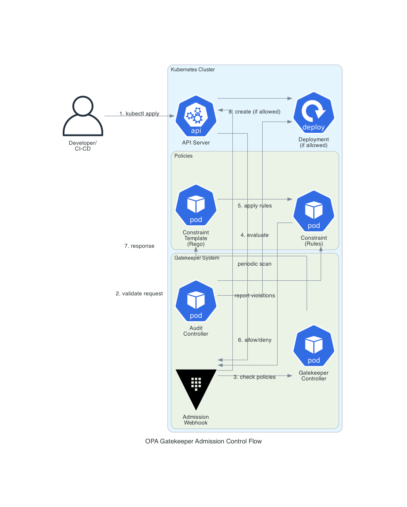
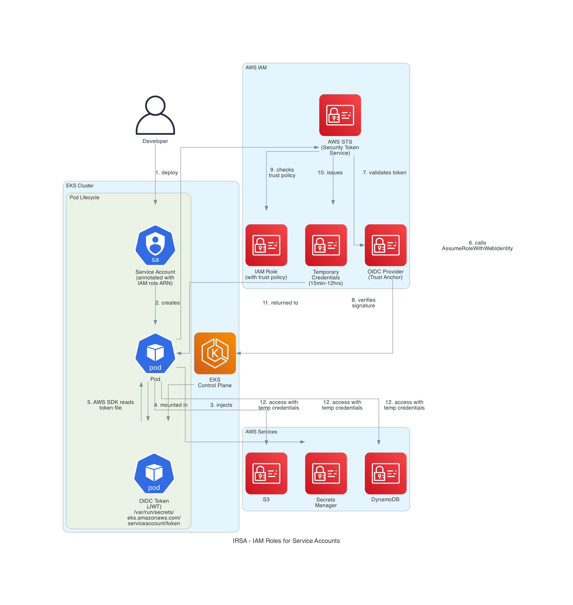
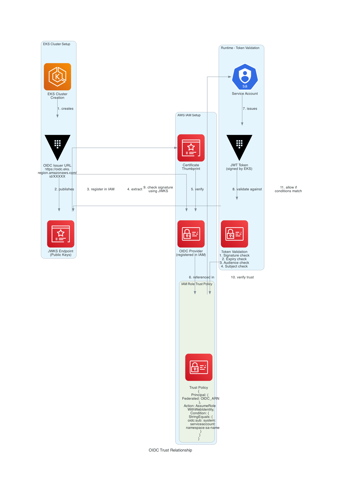

# Architecture Deep Dive - OPA, IRSA, and OIDC

This document provides detailed architecture diagrams and explanations for the three core security mechanisms in this EKS deployment.

## Table of Contents
- [OPA Gatekeeper Admission Control](#opa-gatekeeper-admission-control)
- [IRSA (IAM Roles for Service Accounts)](#irsa-iam-roles-for-service-accounts)
- [OIDC Trust Relationship](#oidc-trust-relationship)

---

## OPA Gatekeeper Admission Control

### Architecture Diagram



### How It Works

**OPA Gatekeeper** is a Kubernetes admission controller that enforces policies using the Open Policy Agent (OPA) policy engine.

#### Flow Breakdown:

1. **Developer/CI-CD** submits a resource (e.g., `kubectl apply -f deployment.yaml`)

2. **API Server** receives the request and triggers admission webhooks

3. **Admission Webhook** intercepts the request before it's persisted to etcd

4. **Gatekeeper Controller** receives the validation request

5. **Constraint Template** (written in Rego) defines the policy logic

6. **Constraint** applies the template rules to specific resource types

7. **Allow/Deny Decision** is returned to the webhook

8. **API Server** either creates the resource (if allowed) or rejects it (if denied)

**Audit Controller** (background process):
- Periodically scans existing resources (every 60 seconds)
- Reports violations of policies
- Doesn't block existing resources, only reports

### Key Components:

**Constraint Template:**
```yaml
apiVersion: templates.gatekeeper.sh/v1
kind: ConstraintTemplate
metadata:
  name: k8srequiredlabels
spec:
  targets:
    - target: admission.k8s.gatekeeper.sh
      rego: |
        package k8srequiredlabels
        violation[{"msg": msg}] {
          # Rego policy logic here
        }
```

**Constraint:**
```yaml
apiVersion: constraints.gatekeeper.sh/v1beta1
kind: K8sRequiredLabels
metadata:
  name: deployment-must-have-labels
spec:
  match:
    kinds:
      - apiGroups: ["apps"]
        kinds: ["Deployment"]
  parameters:
    labels: ["app", "environment"]
```

### Benefits:

✅ **Preventive Security**: Blocks non-compliant resources before creation  
✅ **Policy as Code**: Policies versioned in Git  
✅ **Audit Trail**: Continuous compliance monitoring  
✅ **Flexible**: Custom policies using Rego language  
✅ **No Bypass**: Enforced at API server level  

### Use Cases:

- Enforce security best practices (no privileged containers)
- Ensure resource limits (prevent resource exhaustion)
- Require labels (for cost tracking, organization)
- Block specific image registries
- Enforce naming conventions
- Require network policies

---

## IRSA (IAM Roles for Service Accounts)

### Architecture Diagram



### How It Works

**IRSA** allows Kubernetes pods to assume AWS IAM roles without using static credentials (access keys).

#### Detailed Flow:

**Setup Phase:**

1. **Developer** creates a ServiceAccount with IAM role annotation:
```yaml
apiVersion: v1
kind: ServiceAccount
metadata:
  name: app-sa
  annotations:
    eks.amazonaws.com/role-arn: arn:aws:iam::ACCOUNT:role/app-role
```

2. **Pod** is created using the ServiceAccount

3. **EKS Control Plane** injects an OIDC token as a projected volume:
```
/var/run/secrets/eks.amazonaws.com/serviceaccount/token
```

**Runtime Phase:**

4. **Pod** starts and the token file is mounted

5. **AWS SDK** (boto3, AWS CLI, etc.) automatically detects the token file via environment variables:
```bash
AWS_ROLE_ARN=arn:aws:iam::ACCOUNT:role/app-role
AWS_WEB_IDENTITY_TOKEN_FILE=/var/run/secrets/eks.amazonaws.com/serviceaccount/token
```

6. **AWS SDK** calls `sts:AssumeRoleWithWebIdentity` with the token

7. **AWS STS** validates the token against the OIDC provider

8. **OIDC Provider** verifies the token signature using EKS public keys

9. **STS** checks the IAM role's trust policy to ensure the ServiceAccount is allowed

10. **STS** issues temporary credentials (AccessKeyId, SecretAccessKey, SessionToken)

11. **Temporary credentials** are returned to the pod (valid for 15 minutes to 12 hours)

12. **Pod** uses these credentials to access AWS services (S3, Secrets Manager, DynamoDB, etc.)

### Token Structure (JWT):

```json
{
  "aud": ["sts.amazonaws.com"],
  "exp": 1737456000,
  "iat": 1737452400,
  "iss": "https://oidc.eks.us-east-1.amazonaws.com/id/XXXXX",
  "kubernetes.io": {
    "namespace": "default",
    "pod": {
      "name": "my-pod-abc123",
      "uid": "12345-67890"
    },
    "serviceaccount": {
      "name": "app-sa",
      "uid": "abcde-fghij"
    }
  },
  "sub": "system:serviceaccount:default:app-sa"
}
```

### IAM Role Trust Policy:

```json
{
  "Version": "2012-10-17",
  "Statement": [{
    "Effect": "Allow",
    "Principal": {
      "Federated": "arn:aws:iam::ACCOUNT:oidc-provider/oidc.eks.region.amazonaws.com/id/XXXXX"
    },
    "Action": "sts:AssumeRoleWithWebIdentity",
    "Condition": {
      "StringEquals": {
        "oidc.eks.region.amazonaws.com/id/XXXXX:sub": "system:serviceaccount:default:app-sa",
        "oidc.eks.region.amazonaws.com/id/XXXXX:aud": "sts.amazonaws.com"
      }
    }
  }]
}
```

### Benefits:

✅ **No Static Credentials**: No access keys stored in pods  
✅ **Automatic Rotation**: Credentials auto-refresh before expiry  
✅ **Least Privilege**: Each pod gets only required permissions  
✅ **Audit Trail**: CloudTrail logs show which ServiceAccount made API calls  
✅ **Secure**: Token signed by EKS, validated by AWS  

### Security Features:

- **Token Expiry**: Tokens expire (default 1 hour)
- **Audience Validation**: Token must be for `sts.amazonaws.com`
- **Subject Validation**: Token must match ServiceAccount in trust policy
- **Signature Validation**: Token signed by EKS private key, verified with public key
- **Namespace Isolation**: Trust policy can restrict to specific namespace

---

## OIDC Trust Relationship

### Architecture Diagram



### How It Works

**OIDC (OpenID Connect)** is the authentication protocol that enables the trust relationship between EKS and AWS IAM.

#### Setup Phase:

**1. EKS Cluster Creation:**
- EKS automatically creates an OIDC issuer URL:
```
https://oidc.eks.us-east-1.amazonaws.com/id/9910D38684F455418FB9380CB37B1667
```

**2. JWKS Endpoint:**
- EKS publishes public keys at:
```
https://oidc.eks.us-east-1.amazonaws.com/id/XXXXX/keys
```

**3. Register OIDC Provider in IAM:**
```bash
aws iam create-open-id-connect-provider \
  --url https://oidc.eks.us-east-1.amazonaws.com/id/XXXXX \
  --client-id-list sts.amazonaws.com \
  --thumbprint-list 9e99a48a9960b14926bb7f3b02e22da2b0ab7280
```

**4. Certificate Thumbprint:**
- Extracted from the OIDC issuer's TLS certificate
- Used by AWS to verify the OIDC provider's identity

**5. IAM Role Trust Policy:**
- References the OIDC provider ARN
- Specifies conditions (audience, subject)

#### Runtime Phase:

**6. ServiceAccount Issues Token:**
- Kubernetes API server signs JWT token with EKS private key

**7. Token Validation:**
When pod calls AWS API:

**8. Signature Check:**
- AWS fetches public keys from JWKS endpoint
- Verifies token signature using public key
- Ensures token was issued by EKS

**9. Expiry Check:**
- Validates token hasn't expired (`exp` claim)

**10. Audience Check:**
- Ensures `aud` claim is `sts.amazonaws.com`

**11. Subject Check:**
- Verifies `sub` claim matches trust policy condition
- Format: `system:serviceaccount:namespace:serviceaccount-name`

**12. Trust Policy Evaluation:**
- If all checks pass, IAM allows AssumeRoleWithWebIdentity
- Temporary credentials are issued

### OIDC Discovery Document:

```json
{
  "issuer": "https://oidc.eks.us-east-1.amazonaws.com/id/XXXXX",
  "jwks_uri": "https://oidc.eks.us-east-1.amazonaws.com/id/XXXXX/keys",
  "authorization_endpoint": "urn:kubernetes:programmatic_authorization",
  "response_types_supported": ["id_token"],
  "subject_types_supported": ["public"],
  "id_token_signing_alg_values_supported": ["RS256"],
  "claims_supported": ["sub", "iss"]
}
```

### JWKS (JSON Web Key Set):

```json
{
  "keys": [
    {
      "use": "sig",
      "kty": "RSA",
      "kid": "abc123",
      "alg": "RS256",
      "n": "base64-encoded-modulus",
      "e": "AQAB"
    }
  ]
}
```

### Trust Chain:

```
EKS Cluster
    ↓ (creates)
OIDC Issuer URL
    ↓ (publishes)
Public Keys (JWKS)
    ↓ (registered in)
IAM OIDC Provider
    ↓ (referenced in)
IAM Role Trust Policy
    ↓ (validates)
ServiceAccount Token
    ↓ (grants)
Temporary AWS Credentials
```

### Security Guarantees:

✅ **Cryptographic Verification**: Token signature verified with public key  
✅ **Issuer Validation**: Token must come from registered OIDC provider  
✅ **Audience Restriction**: Token must be for AWS STS  
✅ **Subject Binding**: Token bound to specific ServiceAccount  
✅ **Time-Limited**: Tokens expire and must be refreshed  
✅ **Namespace Isolation**: Trust policy can restrict to namespace  

### Why OIDC?

**Without OIDC (Old Method):**
- Static IAM credentials stored in pods
- Credentials never expire
- Hard to rotate
- No audit trail of which pod made API call
- All pods on node share same credentials

**With OIDC (IRSA):**
- No static credentials
- Automatic rotation
- Per-pod credentials
- Full audit trail (CloudTrail shows ServiceAccount)
- Cryptographically secure

---

## Integration: How They Work Together

### Complete Security Flow:

```
1. Developer creates Deployment
        ↓
2. OPA Gatekeeper validates (labels, limits, security)
        ↓
3. If allowed, Deployment created
        ↓
4. Pod starts with ServiceAccount (IRSA)
        ↓
5. EKS injects OIDC token
        ↓
6. Pod assumes IAM role via OIDC trust
        ↓
7. Pod accesses AWS services with temporary credentials
        ↓
8. Gatekeeper audits pod compliance (ongoing)
```

### Security Layers:

**Layer 1: Admission Control (OPA Gatekeeper)**
- Prevents non-compliant resources from being created
- Enforces organizational policies
- Continuous compliance auditing

**Layer 2: Authentication (OIDC)**
- Establishes trust between EKS and AWS IAM
- Cryptographic verification of identity
- No static credentials

**Layer 3: Authorization (IRSA)**
- Fine-grained AWS permissions per pod
- Temporary credentials with automatic rotation
- Full audit trail in CloudTrail

### Example Scenario:

**Deploy a pod that accesses S3:**

1. **Developer** creates deployment with:
   - Labels: `app=myapp`, `environment=production` ✅
   - Resource limits: CPU/memory defined ✅
   - ServiceAccount: `app-sa` (with S3 IAM role) ✅

2. **OPA Gatekeeper** validates:
   - Has required labels? ✅
   - Has resource limits? ✅
   - Not privileged? ✅
   - **Result**: ALLOWED

3. **Pod starts**:
   - EKS injects OIDC token
   - Token contains: `system:serviceaccount:default:app-sa`

4. **Pod calls S3**:
   - AWS SDK reads token file
   - Calls `sts:AssumeRoleWithWebIdentity`
   - AWS validates token via OIDC provider
   - Checks trust policy matches ServiceAccount
   - Issues temporary credentials
   - Pod accesses S3

5. **Audit**:
   - Gatekeeper: Scans pod every 60s for compliance
   - CloudTrail: Logs S3 API calls with ServiceAccount identity

---

## Verification Commands

### OPA Gatekeeper:
```bash
# Check policies
kubectl get constrainttemplates
kubectl get constraints

# Test policy
kubectl apply -f test-deployment.yaml
```

### IRSA:
```bash
# Check ServiceAccount
kubectl get sa app-sa -o yaml

# Test from pod
POD=$(kubectl get pod -l app=myapp -o jsonpath='{.items[0].metadata.name}')
kubectl exec $POD -- aws sts get-caller-identity
```

### OIDC:
```bash
# Get OIDC issuer
aws eks describe-cluster --name my-eks-cluster --query 'cluster.identity.oidc.issuer'

# Check OIDC provider
aws iam list-open-id-connect-providers

# View JWKS
curl https://oidc.eks.us-east-1.amazonaws.com/id/XXXXX/keys
```

---

## Summary

| Component | Purpose | Benefit |
|-----------|---------|---------|
| **OPA Gatekeeper** | Policy enforcement | Prevents non-compliant resources |
| **IRSA** | AWS authentication | No static credentials in pods |
| **OIDC** | Trust establishment | Secure identity federation |

**Together, they provide:**
- ✅ Defense in depth
- ✅ Zero static credentials
- ✅ Continuous compliance
- ✅ Full audit trail
- ✅ Least privilege access

---

**Last Updated**: January 21, 2026  
**Diagrams**: OPA Gatekeeper, IRSA, OIDC Trust
